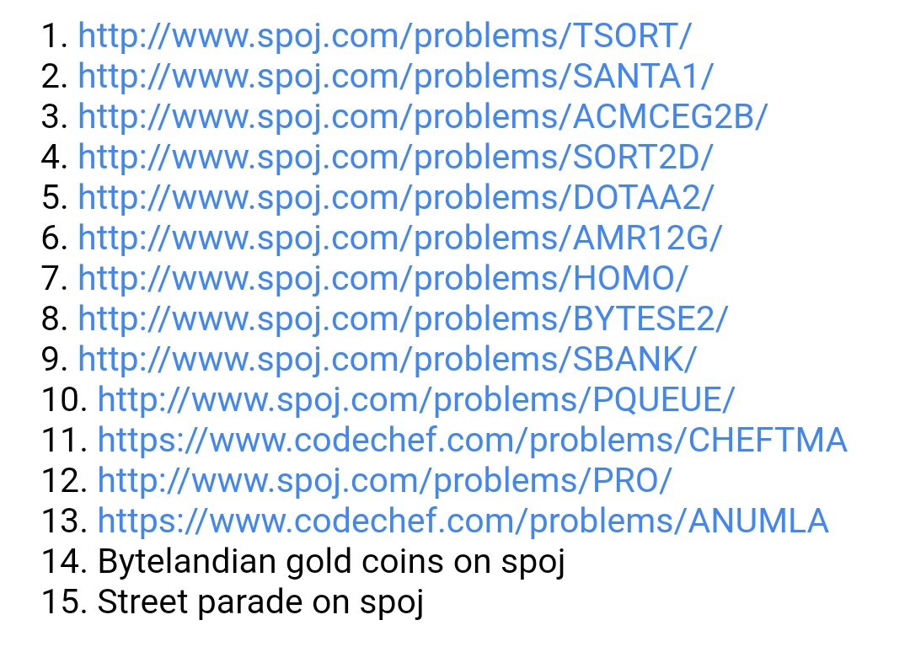

<!-- 
 - Replace all the {} with their values. Name this file as Session {Session no.}.md (without braces) and submit a PR.
-->
# Session 3
STL, Merge Sort, Quick Sort
Conducted on: 24/10/2019

## Agenda
Discussed about the different data structures used in C++ and sorting algrithms like Merge Sort and Quick Sort based on Divide and Conquer Paradigm.

## Resources
TopCoder article 1 and 2 on STL.
Questions to be practised of STL:

Questions on Stacks and Queues to be practised from Hackerrank.

## Summary
Discussed about the different data structures in C++ :
* Vectors/Arrays
* Maps/Unordered Maps/Multimap
* Sets/Unordered Sets/Multiset
* Stacks/Queue
* Priority Queue
* LinkedList/Doubly LinkedList/Circular LinkedList

Discussed Merge Sort and Quick Sort (divide and conquer algorithms)

## Agenda for the next session
Discussions on questions given in previous classes. Start Graph Theory.

## Credits
<!-- Include the Conducted by heading only if someone conducted the session. If it was a session without a specific instructor (For e.g., a common reading session or a mini-hackathon), ignore it. -->
*Conducted by:* Saloni Mohta

*Report compiled by*: Saloni Mohta

*Attendees*: Open class

*Absentees*: Open class
